# Partner Center Connector
Since it is not supported for a partner to redirect a Microsoft online cloud customer to their 
multi-tenant infrastructure either for federation or synchronization this sample was developed.
It is a management agent and metaverse extension for Microsoft Identity Manager,
that leverages the Partner Center API to synchronize customer and users to the partner's 
infrastructure. With this sample and Active Directory Federation Services (ADFS) it is possible 
to utilize the objects in the multi-tenant directory for authorization and Azure AD for authentication.

## How It Works
First you will need to compile both the _Connector_ and _MVExtension_ projects. Then copy all of the files from the 
output directories for both projects to the extensions folder on the server where the Microsoft Identity Manager 
2016 Synchronization Service is installed. Typically the path of the extension directory will be 
_C:\Program Files\Microsoft Forefront Identity Manager\2010\Synchronization Service\Extensions_ unless it was modified 
when the service was installed.

Next you will need to create the required objects in metaverse. These objects are required in order for the management 
agent to perform all operations as excepted. Follow the steps below in order to create the required objects. 

### Prerequisites 
This solution is designed for use with Microsoft Forefront Identity Manager 2010 R2 or Microsoft Identity Manager 2016.
In order to compile the source code you will need to add a reference to _Microsoft.MetadirectoryServicesEx.dll_. You can find 
this file in the _bin_ directory where you have installed the Synchronization Service. The version referenced by the source 
should match the version you have deployed.  

### Add the _Customer_ Object Type
1. Open the _Synchronization Service Manager_ and then click on _Metaverse Designer_
2. Click _Create Object Type_ found in the _Actions_ pane

	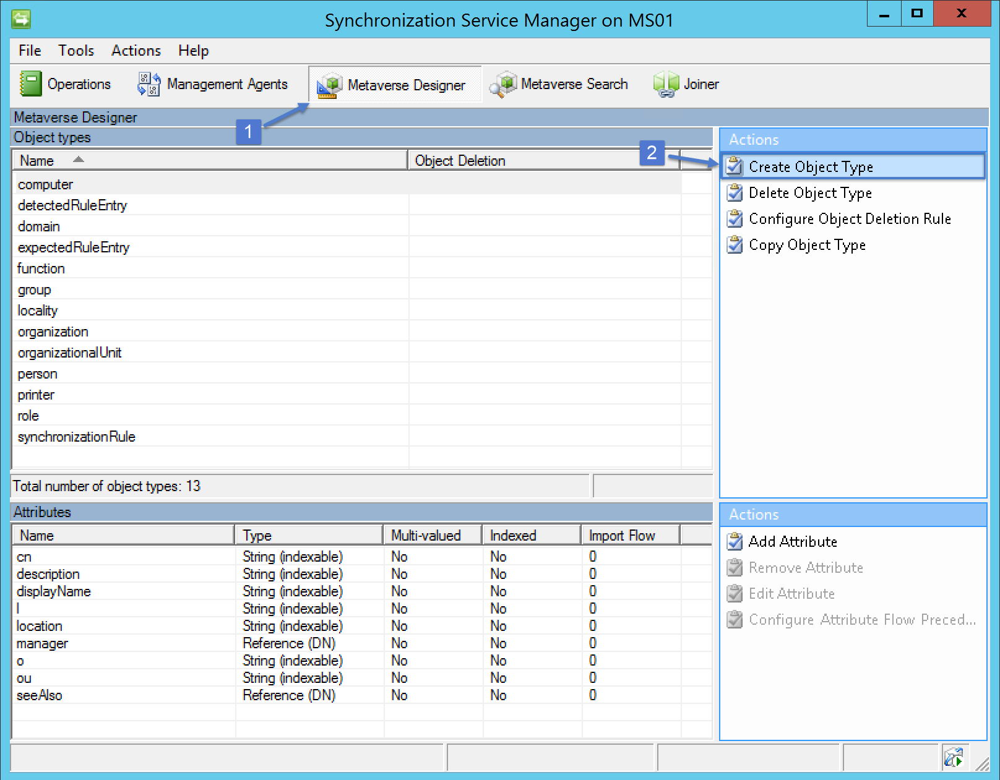

3. Specify _customer_ for the _Object type name_ and select the following attributes: _company_, _domain_, and _objectID_

	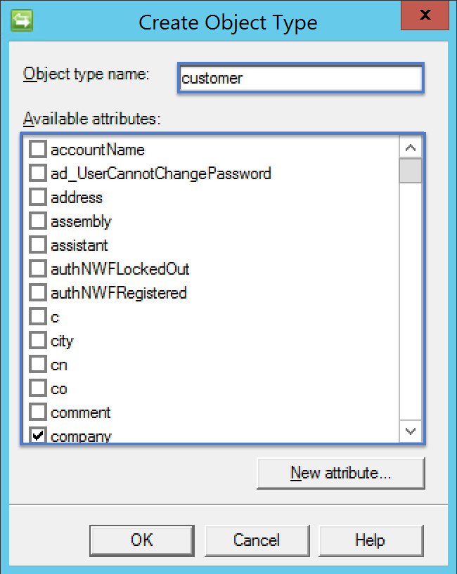

4. Create a new attribute for the tenant identifier and then click _OK_ on the _Create Object Type_ wizard to complete the creation
of the _customer_ object type

	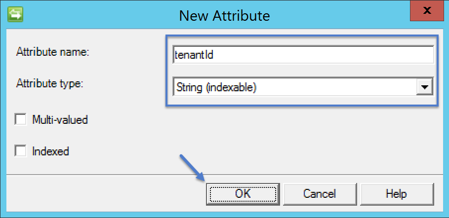

### Add Attributes to Person Object Type
1. Select the _Person_ object and then click _Add Attribute_ in the actions pane

	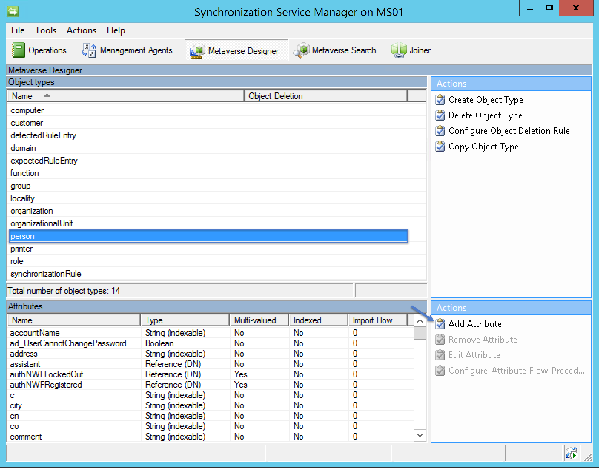

2. Add the attributes documented in the table below

	| Attribute Name   | Attribute Type         | Multi-valued  | Indexed  |
	|------------------|------------------------|---------------|----------|
	|  usageLocation   | String (non-indexable) |      No       |   Yes    |
	|  userPrincalName | String (indexable)     |      No       |   Yes    |

### Setup the Management Agent 
1. Open the _Management Agents_ section of the _Synchronization Services Manager_ and then click _Create_ in the actions pane

	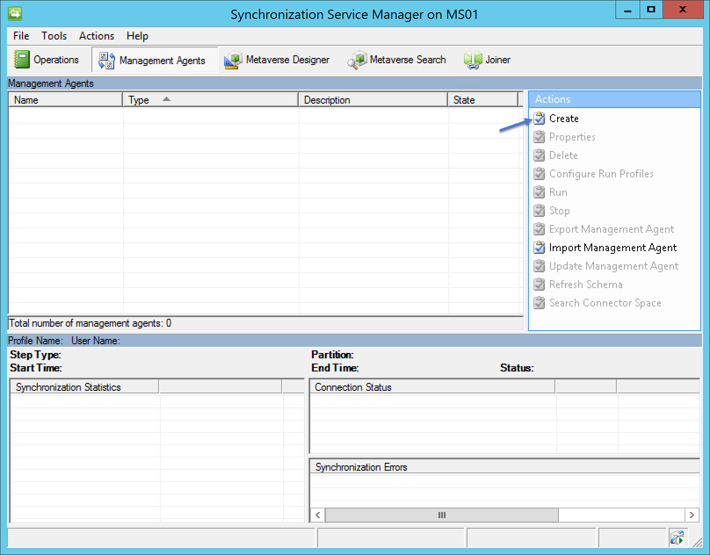

2. Select _Extensible Connectivity 2.0_ from the _Management agent for_ drop down menu
3. Specify an appropriate name (e.g. PCMA, which is short for Partner Center Management Agent) and then click _Next_
4. Select the _Microsoft.PartnerCenter.Connector.dll_ as the extension and then click _Refresh interfaces_. Then click _Next_ to continue
	
	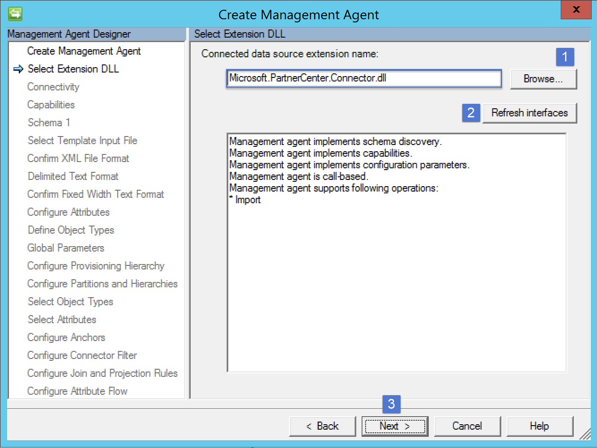

5. Specify an application identifier and secret key that has been configured in Azure Active Directory for use with the Partner Center API. Also, 
specify appropriate credentials that have _AdminAgent_ privileges. 
6. Accept the defaults for the _Configure Partitions and Hierarchies_ page and click _Next_
7. Select the _customer_ and _user_ object types from the _Select Object Types_ page and then click _Next_
8. Select all of the attributes on the _Select Attributes_ page and then click _Next_
9. Accept the defaults for the _Configure Anchors_ page and then click _Next_
10. Accept the defaults for the _Configure Connectors Filter_ and then click _Next_
11. Create the following join and projection rules

	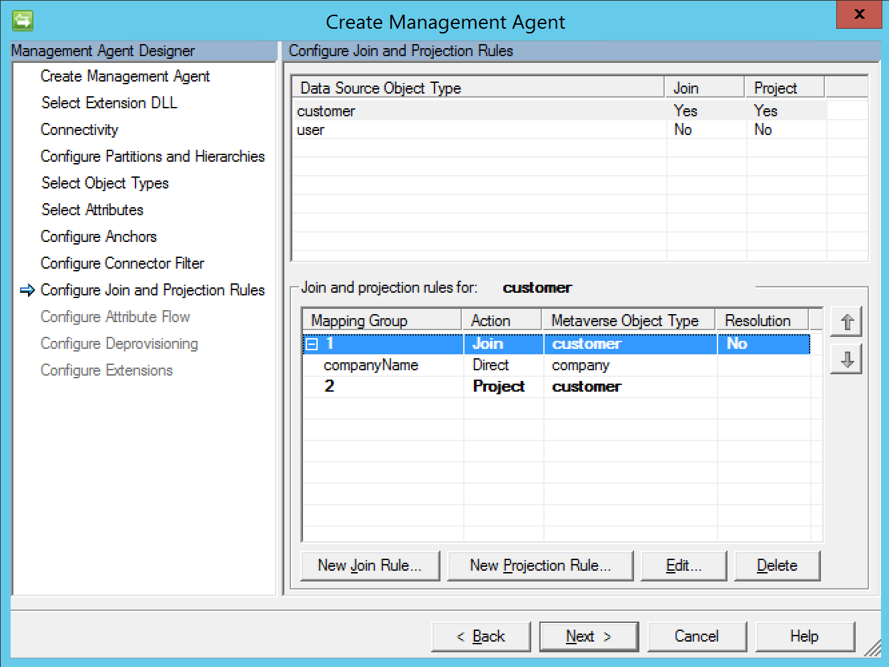

	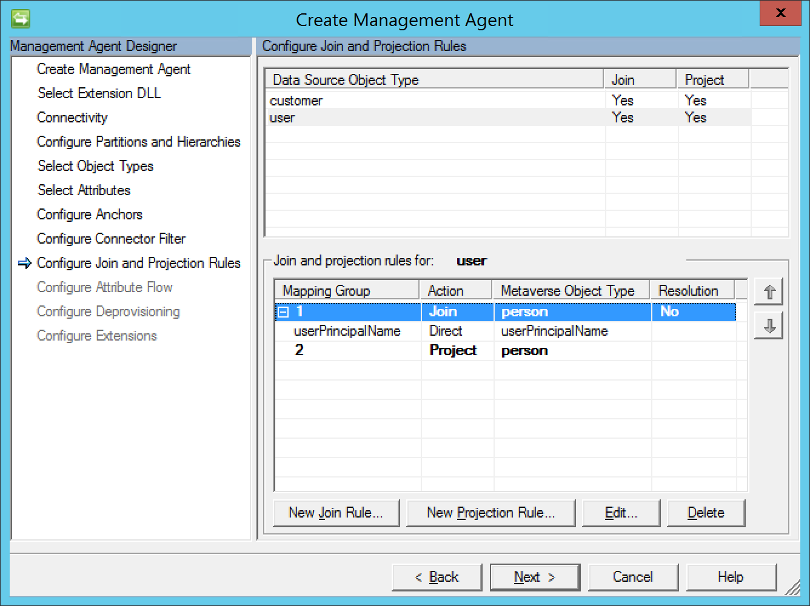

12. Configure the appropriate attribute flows as shown in the figure below 

	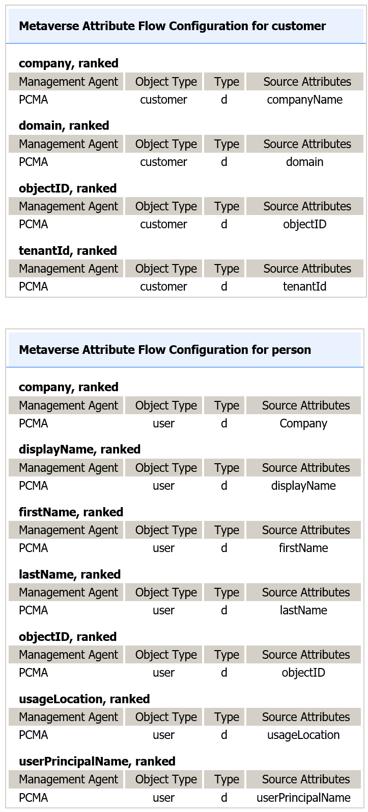

13. Accept the defaults for the _Configure Deprovisioning_ page and then click _Next_
14. Click _Finish_ to complete the _Create Management Agent_ wizard

### Create Active Directory Management Agent
The Active Directory Management Agent will be perform the provisioning of organizational units and users within the partner's instance of 
Active Directory. Perform the following steps in order to create the management agent

1. Open the _Management Agents_ section of the _Synchronization Services Manager_ and then click _Create_ in the actions pane
2. Select _Active Directory Domain Services_ from the _Management agent for_ drop down menu
3. Specify _ADMA_ for the name. If you would like to utilize a different name then you will need to update _Provision_ function in the 
metaverse entension. 

	```csharp 
    public void Provision(MVEntry mventry)
    {
        ConnectedMA agent;
        int connectors;

        try
        {
			// The following line of code will need to be modified if you utilize a different name for the 
			// Active Directory management agent. 
            agent = mventry.ConnectedMAs["INSERT-THE-APPROPRIATE-NAME-HERE"];
            connectors = agent.Connectors.Count;

            if (connectors != 0)
            {
                return;
            }

            if (mventry.ObjectType.Equals("customer", StringComparison.CurrentCultureIgnoreCase))
            {
                ProvisionCustomer(agent, mventry);
            }
            if (mventry.ObjectType.Equals("person", StringComparison.CurrentCultureIgnoreCase))
            {
                ProvisionPerson(agent, mventry);
            }
        }
        finally
        {
            agent = null;
        }
    }
	```
4. Specify the appropriate connection infomration on the _Connect to Active Directory Forest_ page and then click _Next_
5. On the _Configure Directory Partitions_ page select the appropriate partition, then click _Containers_ to select the organizational 
units that needed to be included in the synchronization process. Be sure to include the organization unit specified in the _Settings.xml_
utilized by the metaverse extension. 

	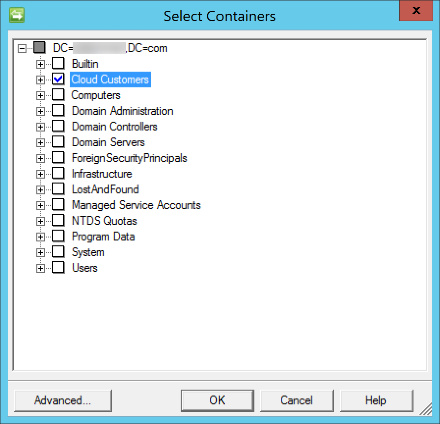

6. On the _Configure Provisioning Hierarchy_ page map _ou_ to _organizationalUnit_. With this configuration any organization unit the path 
of the user being provisioned that does not exist will be created automatically. 

	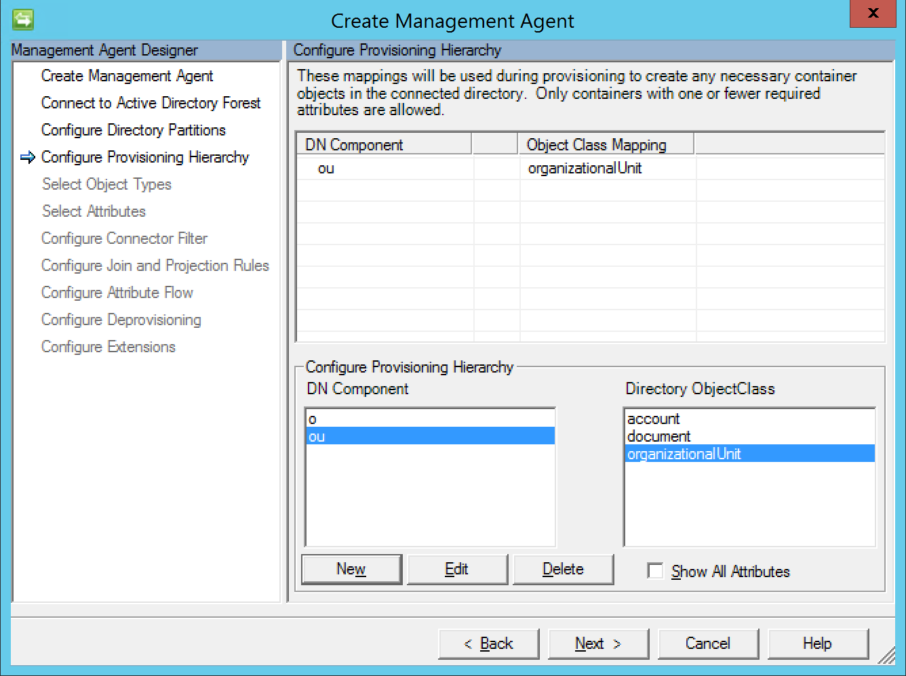

7. On the _Select Object Types_ page select user and then click _Next_
8. On the _Select Attributes_ page select the following attributes: company, displayName, givenName, sAMAccountName, sn, unicodePwd,
userAccountControl, and userPrincipalName. Once all of these attributes has been selected click _Next_
9. Click _Next_ on the _Configure Connector Filters_ page to accept the defaults
10. Create a join connector for the _user_ object type

	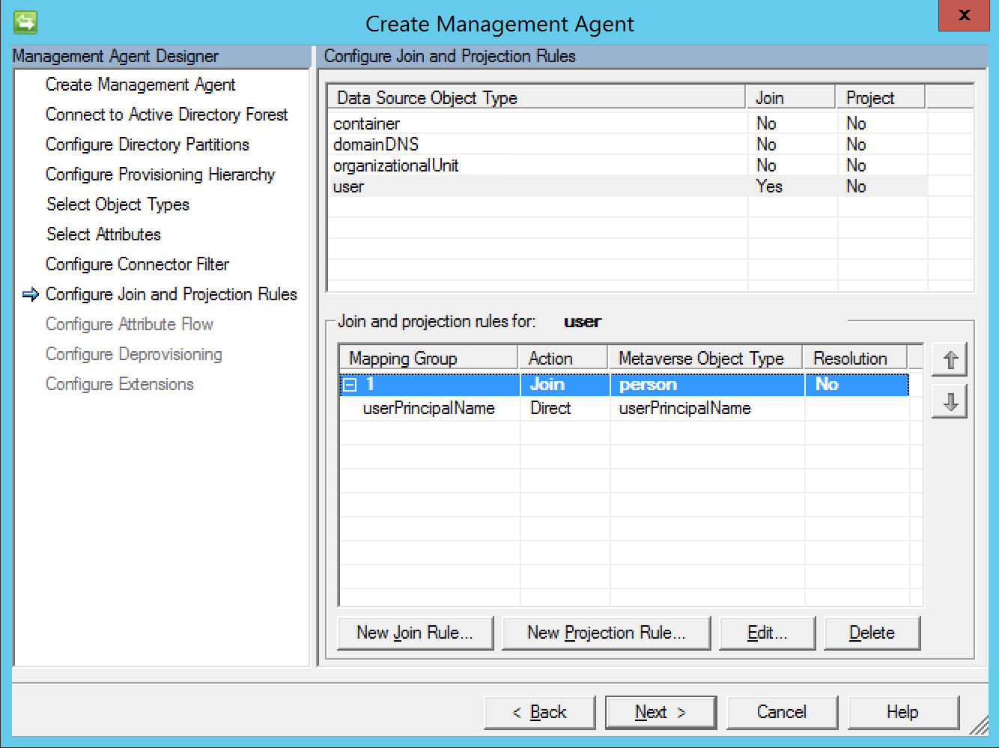

11. On the _Configure Attribute Flow_ configure the flows shown in table below

	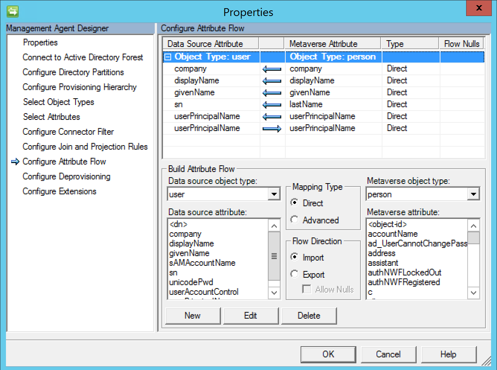

12. On the _Configure Deprovisioning_ page click _Next_ to accept the defaults
13. On the _Configure Extensions_ page click _Finish_ to accept the defaults and finish creating the AD management agent

### Enabling Provisioning
A metaverse extension is utilized to provision objects into Active Directory. This is not required if you are planning to leverage the Microsoft Identity Manager 
Portal. 

1. Click _Tool_ and then select _Options_
2. Configure the options as shown in the figure below and then click _OK_

	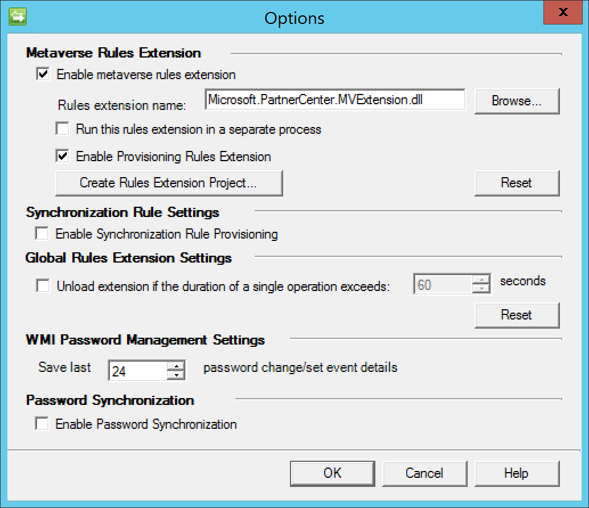

3. Modify the _Settings.xml_ configuration file found in the extension directory (_C:\Program Files\Microsoft Forefront Identity Manager\2010\Synchronization Service\Extensions_).
This file controls where the users will be created and what base password they will be assigned. Please note that all user accounts provisioned through this process will be disabled 
by default.

### Running the Sample
This solution requires that a _Full Import_ and _Full Synchronization_ be performed against the AD management agent before
attempting any other operation. To avoid any issues it is recommended that you execute the following run profiles against the specified
management agent

| Run Profile   | Management Agent       |
|---------------|------------------------|
|  Full Import  | ADMA                   |
|  Full Sync    | ADMA                   |
|  Full Import  | PCMA                   |
|  Full Sync    | PCMA                   |
|  Full Import  | ADMA                   |
|  Full Sync    | ADMA                   |
|  Export       | ADMA                   |
|  Delta Import | ADMA                   |

## Code of Conduct 
This project has adopted the [Microsoft Open Source Code of Conduct](https://opensource.microsoft.com/codeofconduct/). For more 
information see the [Code of Conduct FAQ](https://opensource.microsoft.com/codeofconduct/faq/) or contact 
[opencode@microsoft.com](mailto:opencode@microsoft.com) with any additional questions or comments.

## License
Copyright (c) Microsoft Corporation. All rights reserved.

Licensed under the [MIT](LICENSE) License.